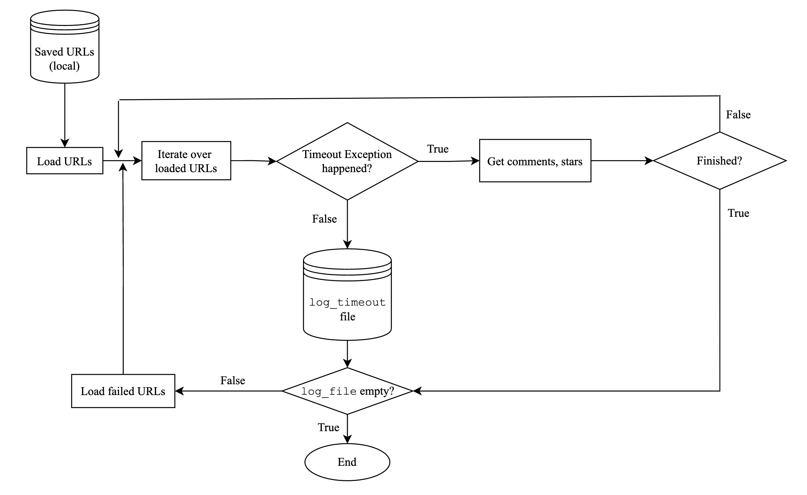
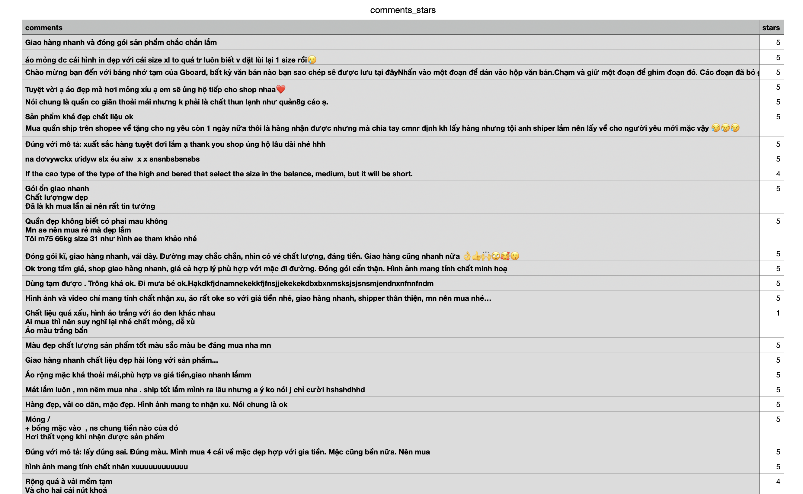

# Shopee Web Crawler
This is my project to create a bot for the purpose of scraping comments and stars from [Shopee](https://shopee.vn/) products. 
In general, I am going to crawl URLs of categories from the homepage, and then URLs of products from 
each collected category. This project successfully handled the Timeout Exception when loading URLs 
is crashed, so the crawlers will run stably and not leave out the failed-to-load URLs. All of the code
is written in OOP style so that it is easier to handle and develop more features.

## Installation
* Run `pip install -r requirements.txt` to install all the packages you need
* Main packages: `selenium`, `webdriver-manager`
* To use `chromedriver` locally in macOS, we need to run command `xattr -d com.apple.quarantine chromedriver`

## Development Environment
* Python virtual environment: 
    * Run `python3 -m venv <name of the virtual env>` (Python $3.10.0$) to create a new virtual environment
    * Run `source ./<name of the virtual env>/bin/activate` to activate the environment
* macOS Ventura $13.0.1$
* `chromedriver` version: $107.0.5304.62$ ([link](https://chromedriver.storage.googleapis.com/index.html?path=107.0.5304.62/))

## Tutorials
1. Run the command `python main.py --category` to grab all URLs of categories
2. Run `python main.py --product` to get all URLs of products of each category
3. Run `python main.py --comment` to get all comments from products URLs

## Handling the Timeout Exception

    

<i>An algorithm to deal with the Timeout Exception.</i>

## Results
All comments, stars are saved in `data` directory.

At this time, I've just shown an example of grabbing comments and stars from a category called 'Thời trang nam'.

When you run this program, it'll take the amount of comments and stars depending on the hyperparameters.

    

<i>An example result.</i>

