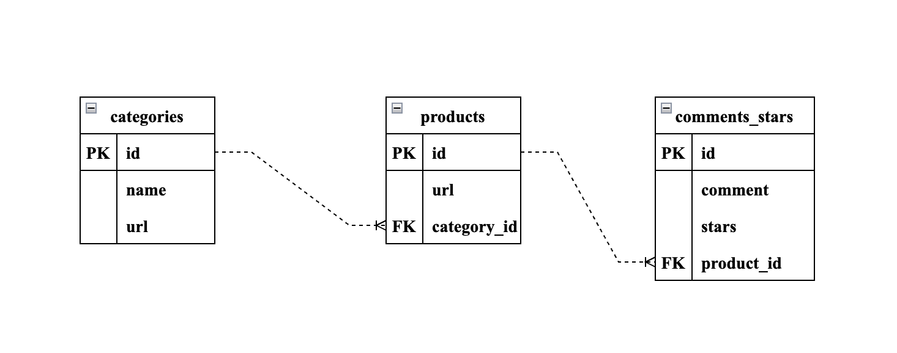
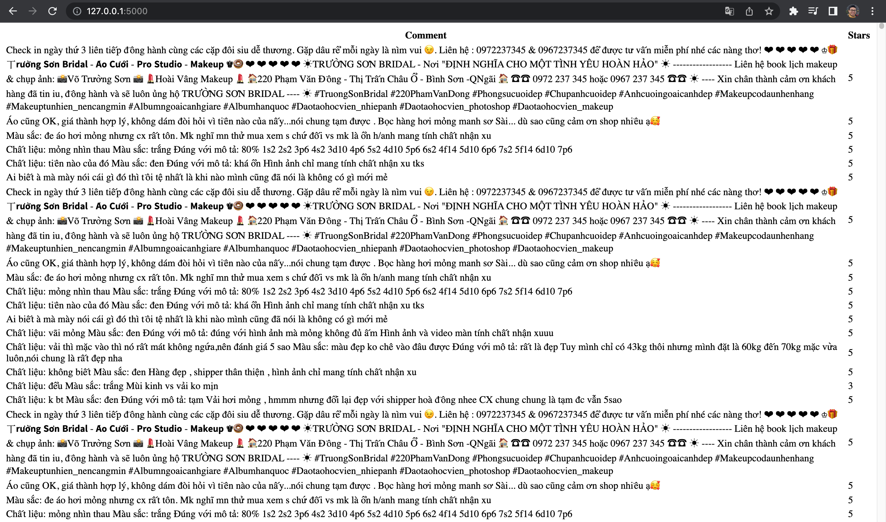

# Shopee Web Crawler

This project aims to create a bot that can scrape comments, stars, and URLs from Shopee products. To do this, the bot collects URLs of categories from the homepage, and then URLs of products from each of these categories. This project has been designed to handle Timeout Exceptions when loading URLs, ensuring that the crawlers run stably and that no URLs are left out. A database has been set up to store the collected comments, stars, and URLs. All of the code has been written in an object-oriented programming style in order to make it easier to manage and develop additional features.

Video Demo: https://youtu.be/eGsTbn_w_Ys

## Installation

- Run `pip install -r requirements.txt` to install all the packages you need
- Main packages: `selenium`, `webdriver-manager`
- To use `chromedriver` locally in macOS, we need to run command `xattr -d com.apple.quarantine chromedriver`

## Development Environment

- Python virtual environment:
  - Run `python3 -m venv <name of the virtual env>` (Python `3.10.0`) to create a new virtual environment
  - Run `source ./<name of the virtual env>/bin/activate` to activate the environment
- macOS Ventura `13.0.1`
- `chromedriver` depends on your Google Chrome version you are using. In this case, I'm going to choose version: `108.0.5359.71` (Download [here](https://chromedriver.chromium.org/downloads))

## Tutorials

1. Run the command `python main.py --category` to grab all URLs of categories
2. Run `python main.py --product` to get all URLs of products of each category
3. Run `python main.py --comment` to get all comments from products URLs
4. Run `flask run` to run the web app for showing results

## Handling the Timeout Exception

    

<i>An algorithm to deal with the Timeout Exception.</i>

## Database Design

    

<i>Categories, products and comments_stars tables design.</i>

## Demo Results

1. CSV view:
   All comments, stars are saved in `data` directory.

  

<i>A CSV view demo.</i>

2. Web view:

  

<i>A web view demo.</i>

3. When you run this program, it'll take the amount of comments and stars depending on the hyperparameters `PRODUCTS_PER_CATEGORY` and `COMMENTS_STARS_PER_PRODUCT`.

## Notes

- Note that at some time in point in the future, the XPATH of the website may be changed so you need to take a look at them and keep it up to date to make the code run correctly.
